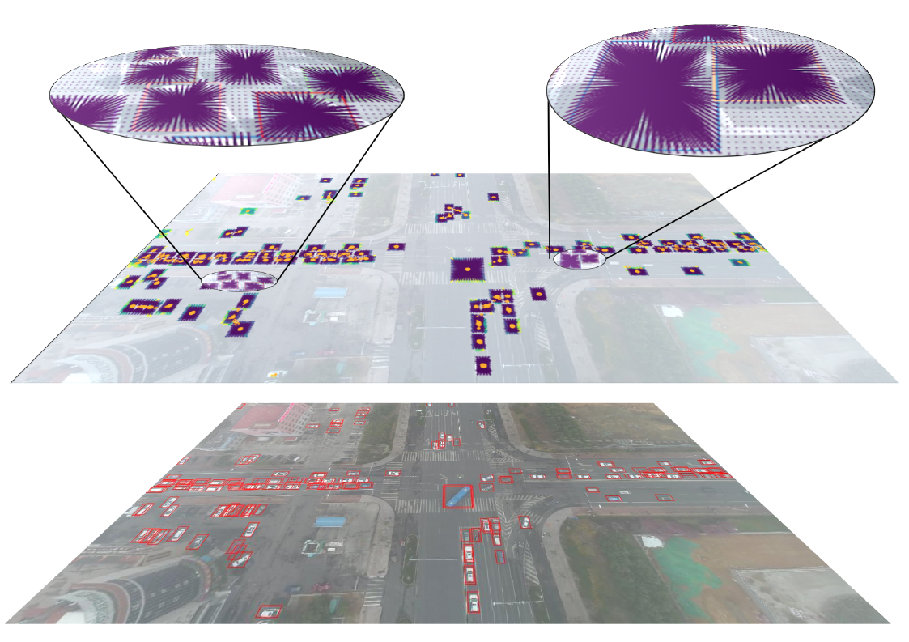
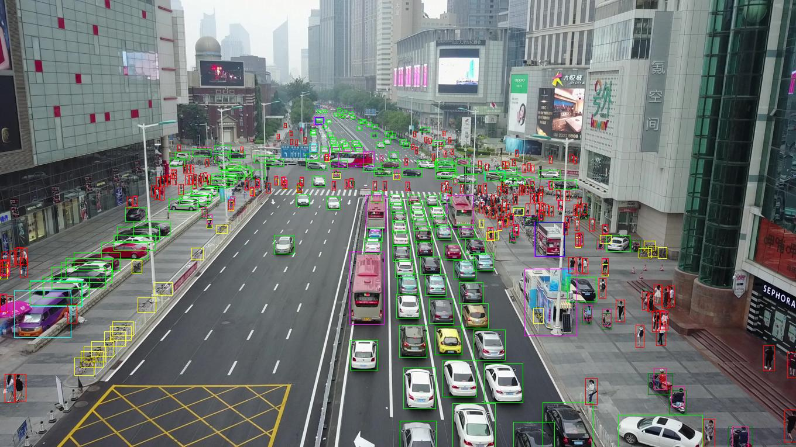
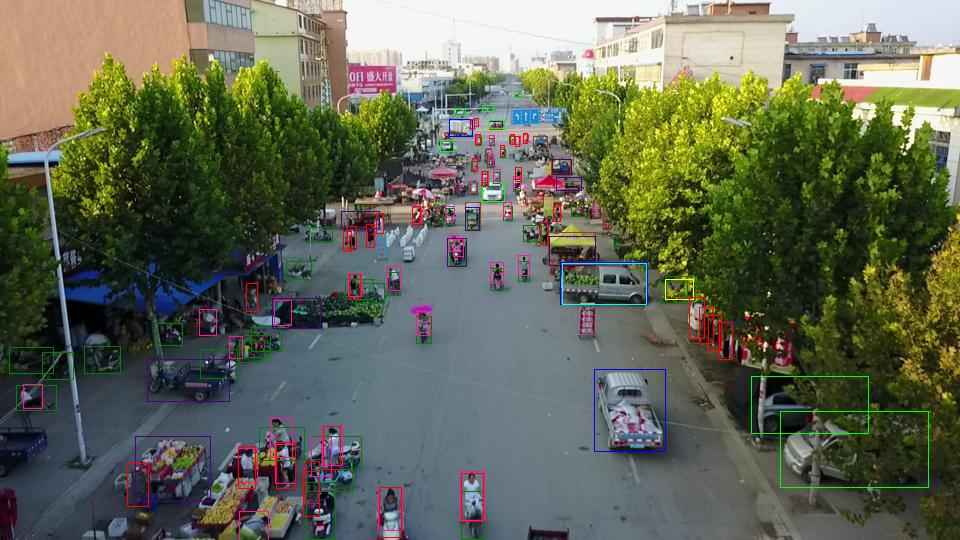
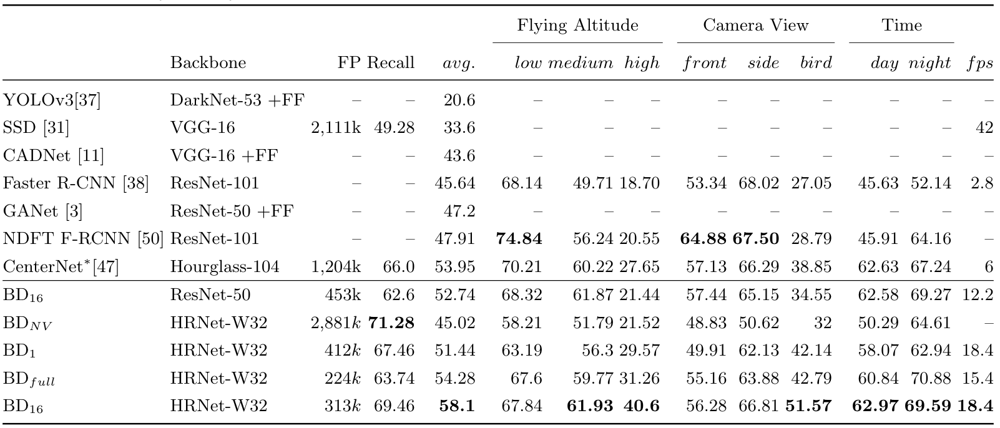
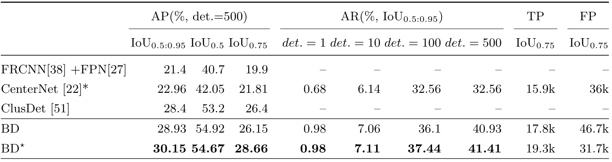

# Butterfly Detector

## Butterfly Detector for Aerial Images


> Current state-of-the-art object detectors have achieved high performance
> when applied to images captured by standard front facing cameras. When applied
> to high-resolution aerial images captured from a drone or UAV stand-point,
> they fail to generalize to the wide range of objects' scales. In order to
> address this limitation, we propose an object detection method called
> Butterfly Detector that is tailored to detect objects in aerial images. We
> extend the concept of fields and introduce butterfly fields, a type of
> composite field that describes the spatial information of output features as
> well as the scale of the detected object. To overcome occlusion and viewing
> angle variations that can hinder the localization process, we employ a voting
> mechanism between related butterfly vectors pointing to the object center. We
> evaluate our Butterfly Detector on two publicly available UAV datasets
> (UAVDT and VisDrone2019) and show that it outperforms previous state-of-the-art
> methods while remaining real-time.

# Demo

<!--Solarized dark                                                                               |  Solarized Ocean
:-------------------------------------------------------------------------------------------:|:-------------------------:
  |  -->
 
<!---->

### Setup

Python 3 is required. Python 2 is not supported.
Do not clone this repository
and make sure there is no folder named `butterflydetector` in your current directory.

```sh
pip3 install butterflydetector
```

For development of the butterflydetector source code itself, you need to clone this repository and then:

```sh
pip3 install numpy cython
pip3 install --editable '.[train,test]'
```

The last command installs the Python package in the current directory
(signified by the dot) with the optional dependencies needed for training and
testing.

### Data structure

    data         
    ├── UAV-benchmark-M
        ├── test
        ├── train
    ├── VisDrone2019
        ├── VisDrone2019-DET-train
            ├── annotations
            ├── images
        ├── VisDrone2019-DET-val
        ├── VisDrone2019-DET-test-dev

# Interfaces

* `python3 -m butterflydetector.predict --help`
* `python3 -m butterflydetector.train --help`
* `python3 -m butterflydetector.eval --help`
* `python3 -m butterflydetector.logs --help`

Tools to work with models:

* `python3 -m butterflydetector.migrate --help`


# Benchmark
Comparison of AP (%), False Positives (FP), and Recall (%) with state-of-the-art methods on UAVDT datasets.


Comparison of AP (average precision), AR (average recall), True Posi-tives (TP), and False Positives (FP) with state-of-the-art methods on VisDronedataset



# Visualization

To visualize logs:

```sh
python3 -m butterflydetector.logs \
  outputs/<model1-basename>.pkl.log \
  outputs/<model2-basename>.pkl.log \
  outputs/<model3-basename>.pkl.log
```


# Train

See [datasets](docs/datasets.md) for setup instructions.

The exact training command that was used for a model is in the first
line of the training log file.

Train a HRNetW32-det model on the VisDrone Dataset:

```sh
time CUDA_VISIBLE_DEVICES=0,1 python3 -m butterflydetector.train \
  --lr=1e-3 \
  --momentum=0.95 \
  --epochs=150 \
  --lr-decay 120 140 \
  --batch-size=16 \
  --basenet=hrnetw32det \
  --head-quad=1 \
  --headnets butterfly10 \
  --square-edge=512 \
  --lambdas 1 1 1 1 \
  --dataset visdrone
```

You can refine an existing model with the `--checkpoint` option.

# Evaluation

The command below will run your model on visdrone and save the predictions in the output directory. The predictions are saved in the correct format to be read by the official Matlab evaluator of VisDrone2019. To evaluate on UAVDT, simply replace 'visdrone' to 'uavdt'.


```sh
python -m butterflydetector.eval --checkpoint <directory-to-checkpoint> --dataset visdrone --output <directory-to-store-predictions> --seed-threshold 0.1
```

# Video

Processing a video frame by frame from `video.avi` to `video.pose.mp4` using ffmpeg:

```sh
export VIDEO=video.avi  # change to your video file

mkdir ${VIDEO}.images
ffmpeg -i ${VIDEO} -qscale:v 2 -vf scale=641:-1 -f image2 ${VIDEO}.images/%05d.jpg
python3 -m butterflydetector.predict --checkpoint resnet152 --glob "${VIDEO}.images/*.jpg"
ffmpeg -framerate 24 -pattern_type glob -i ${VIDEO}.images/'*.jpg.skeleton.png' -vf scale=640:-2 -c:v libx264 -pix_fmt yuv420p ${VIDEO}.pose.mp4
```

In this process, ffmpeg scales the video to `641px` which can be adjusted.


<!--# Documentation Pages

* [datasets](docs/datasets.md)
* [Google Colab demo](https://colab.research.google.com/drive/1H8T4ZE6wc0A9xJE4oGnhgHpUpAH5HL7W)
* [studies.ipynb](docs/studies.ipynb)
* [evaluation logs](docs/eval_logs.md)
* [performance analysis](docs/performance.md)-->

# Citation

```
@misc{adaimi2020perceiving,
      title={Perceiving Traffic from Aerial Images}, 
      author={George Adaimi and Sven Kreiss and Alexandre Alahi},
      year={2020},
      eprint={2009.07611},
      archivePrefix={arXiv},
      primaryClass={cs.CV}
}
```
